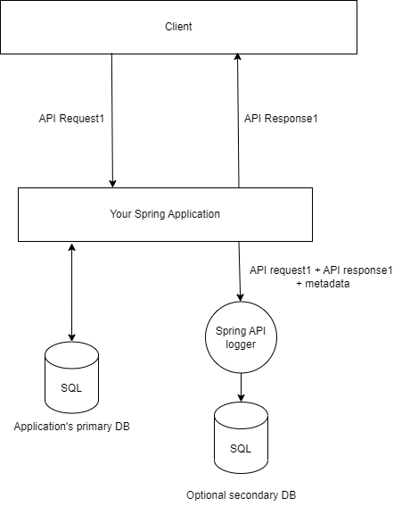

# Spring Library To Potentially Log and Store Every API request?

Created: July 9, 2023 12:59 PM
Tags: SystemDesigning

# Disclaimer

The intention of the article is to see whether a solution which remotely resolves the problem statement exists or not. This article will also highlight the places which were looked at and will finally draw a conclusion based on the short lived and poor research that was done. 

I myself am not in a position to give a definite answer the question in title.  The agenda is to have a productive discussion and if there was a need for such a library, realize what would be the best option to go for.

---

# Problem Statement

## Overview

Create a library which gets coupled with your spring application and logs every API request that is being sent to it. This library will operate as a separate Spring instance, just like Spring Config Server or Spring Eureka Server.

## Addition Features

Although the overview covers the minimum requirement to what we want. But without these addition features, our problem will perhaps be reduced to a few lines on the [API interceptors](https://docs.spring.io/spring-framework/docs/current/javadoc-api/org/springframework/web/servlet/HandlerInterceptor.html) or filters . It would be a pretty bad solution, but its still a solution!

Here, we will highlight some features that are required to make such a library fit for production. I will list them down according to a priority that I personally see fit. 

1. Needs to be stateless and distributed.
2. Option to exclude and include particular API requests
3. Multiple log storage options. Primarily JDBC compatible databases, which can be easily integrated using spring libraries.
4. Give user the ability to include, exclude different API metrics from logging. For eg: user should have to ability to not store the response or request payload. Maybe someone only wants to store the API response time etc.
5. Encrypt specific API metrics. For eg: You don’t want the basic authentication headers to be stored as plain text.

## The Possibilities!

With the above features in order, we can perhaps link this data to  [Grafana](https://grafana.com/) or [Metabase](https://www.metabase.com/) for telemetry, alarms and tracking other metrics. 

Or, if the data storage format is standardized, people can contribute with their own Grafana like applications for this. The possibilities are endless!

Basically, we can have our own inhouse, open-source, cloud native [cloud watch](https://docs.aws.amazon.com/AmazonCloudWatch/latest/monitoring/WhatIsCloudWatch.html). 

---

# A ****very**** high level architecture.

The client will be sending API requests to your Spring application. Your spring application in turn, finishes processing the request and logs the API request using our Spring API logger. 

The metadata might contain processing time, the response status code and other performance related metrics. 

---

# Concerns

There are some obvious concerns to a library like this. 

1. Every API request to your application comes with an additional network call to the logger. This can perhaps be reduced with some level of queueing + batching.
2. These additional network calls can potentially become very expensive. 
3. Not taking proper care while logging may result in some massive security breaches. 

## The Silver lining

The above concerns are precisely why we need to have a granular configuration model. Users might not and perhaps should not log *****every***** API request that they get. But the library still should provide the ability to do so. Users can modulate their cost and performance by picking and choosing what they wish to monitor. 

---

# What can we use?

## OpenTelemetry

There’s a [good open telemetry demo](https://www.baeldung.com/spring-boot-opentelemetry-setup) for what we want to do. This will provide a dashboard which displays relevant metrics for all your data.