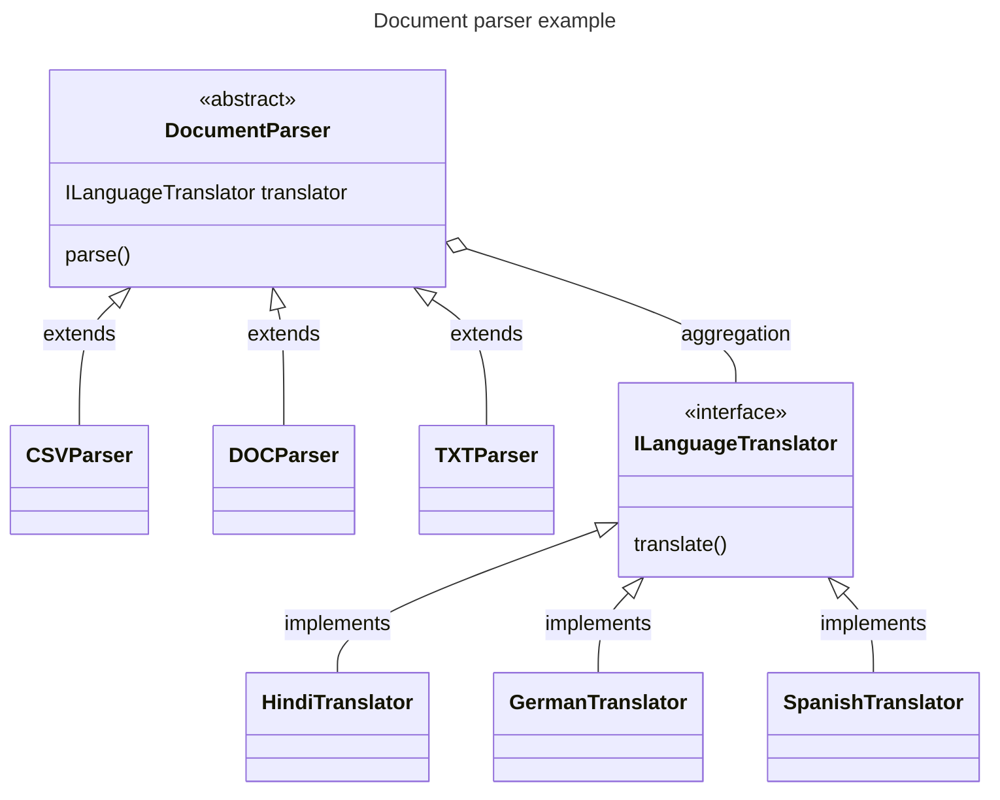

# [STRUCTURE] Bridge Design Pattern

Created: June 30, 2022 12:49 PM
Tags: designpattern

# Bridge Design Pattern

Bridge design pattern is a pattern which is supposed to loosen the coupling between the abstract and the implementation. There are 4 key parts of this pattern

1. ****************************Abstraction -**************************** The highest level abstraction in the client code. For eg: If I was creating a document parser for CSV, DOC, TXT. Then the highest level abstraction would be the common parser interface. 
2. ********************************************Refined Abstraction -******************************************** This is an extension of **********************abstraction**********************. So, in our example we will have separate refined abstractions for CSV, DOC, TXT
3. **********************************Implementer -********************************** Our abstractions are supposed to contain instances of this implementer. This implementer will typically be some extension to the functionality of the abstraction. Let’s say in our parser we want to add the functionality to translate the raw parsed output into some specific language. Then we can create implementer which takes raw text and translates and add its instance in the abstraction. This implementer should not depend on the **********************************************************************************************************************************************************refined abstraction, but only on the abstraction.********************************************************************************************************************************************************** 
4. ********************************************************Concrete Implementer -******************************************************** We will need actual implementations of the implementer. This will be it. In our example, we will have concrete implementations to create Hindi translators, German translators. 

---

## Problem Statement

<aside>
💡 We will be creating a problem statement in accordance to the example that we provided in the pattern description.

</aside>

We need a document parser which will parse TXT, CSV, DOC files and give the output in raw text. 

But we also want to add other constraints to it as well. We want to TXT parser to give the output in Hindi. The CSV parser to give the output in German, the DOC parser to give the output in Spanish.

## UML



## Code

```java
final DocumentParser csvParser = new CSRParser(new GermanTranslator());
final DocumentParser txtParser = new TXTParser(new HindiTranslator());
final DocumentParser docParser = new DOCParser(new SpanishTranslator());
// we will only execute for CSR right now
// but similar operation can be done for all the parsers
csvParser.parse(); // lets assume that the parse function internally utilizes the translator
```